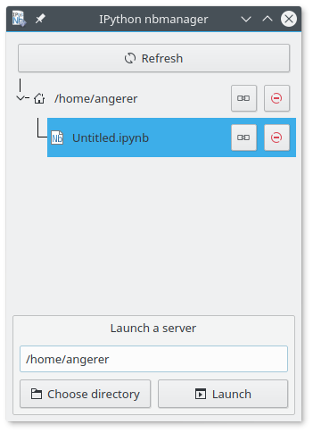

See and stop running IPython Notebook servers

To launch, clone the repository and build the resource files using::

    python3 uic2.py

Then run::

    python3 -m nbmanager
    
It requires Python 3, qtpy and Jupyter.

